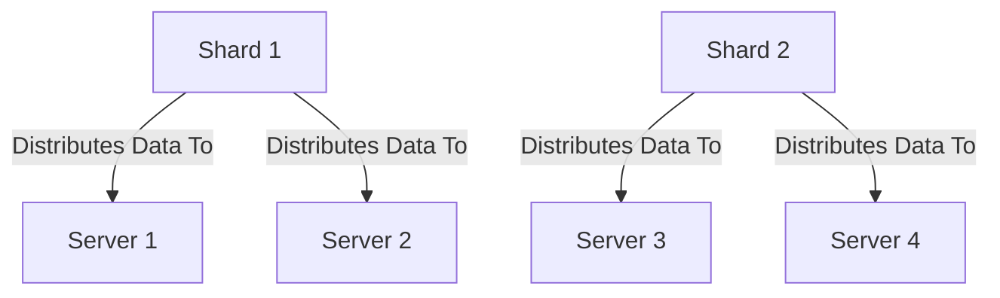
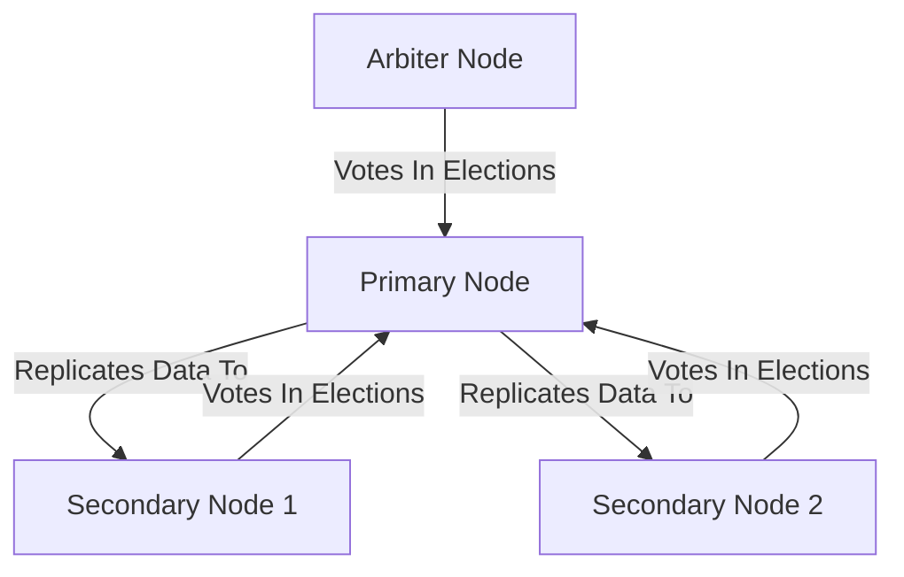

# Chapter 3: Pros, Cons, and Advanced Features

In this chapter, we will explore the advantages and disadvantages of MongoDB compared to traditional SQL databases. We will also delve into some of the advanced features and capabilities of MongoDB.

---

## Pros and Cons of MongoDB

MongoDB has several advantages and disadvantages that make it a unique choice for many applications.

### Pros

- **Flexible schema design**: MongoDB is a NoSQL database, which means it does not have a fixed schema like SQL databases. This makes MongoDB very flexible and easy to adapt to changing requirements. Unlike SQL databases, where you need to determine and declare a table's schema before inserting data, MongoDB's collections do not enforce document structure. This flexibility facilitates the mapping of documents to an entity or an object.
---
- **Horizontal scalability**: MongoDB is designed to be scaled out. It supports sharding, which allows you to distribute data across multiple servers. This means that MongoDB can handle a large increase in data volume by simply adding more servers to the database. This is a significant advantage over traditional SQL databases that are designed to scale up, i.e., to handle more data by upgrading the server hardware.

---
- **High performance for read-heavy workloads**: MongoDB can provide high performance for read and write operations. Its document-oriented model allows for complex queries and efficient indexing. This means that MongoDB can handle a large number of read and write operations per second, making it suitable for high-traffic applications.
---
- **No need for complex joins**: MongoDB uses two methods to establish relationships between data: embedding and linking. This eliminates the need for complex joins that are common in SQL databases. This can simplify the database design and improve performance.
---
- **Replica sets**: MongoDB uses replica sets to provide high availability and data redundancy. A replica set in MongoDB is a group of mongod processes that maintain the same data set. Replica sets provide redundancy and high availability, and are the basis for all production deployments. This feature ensures that your data is always available and secure, even in the event of a system failure.

    - **Replica Set Architecture**: A replica set consists of several nodes, including primary and secondary nodes, as well as optional arbiter nodes. The primary node receives all write operations, while the secondary nodes replicate the primary node's data set and can serve read operations to distribute the load.

    - **Failover and Automatic Elections**: If the primary node fails, the replica set automatically holds an election to determine the new primary node. This ensures that the database remains available even if a node fails.

    - **Read and Write Concerns**: MongoDB uses read and write concerns to control the consistency and durability guarantees of data operations in replica sets. For example, a write concern of "majority" ensures that a write operation is not considered complete until it has been successfully written to the majority of the nodes in the replica set. This helps to prevent data loss in the event of a node failure but requires careful consideration as it can impact performance.

---
### Cons

- **Lack of ACID transactions across multiple documents**: MongoDB does not support traditional ACID transactions. However, it does provide atomic operations on a single document. This means that while you can ensure that a single document write operation is atomic, you cannot ensure the same for operations that affect multiple documents or collections.

- **Limited support for complex transactions**: While MongoDB is great for many use cases, it's not the best choice for applications that require complex transactions with multiple operations or single operations that affect multiple collections or documents. This is because MongoDB does not support joins, and multi-document transactions can be more difficult to handle in MongoDB than in SQL databases.

- **Higher memory usage**: MongoDB can use a lot of memory because each document stores field names. This means that for collections with a large number of small documents, the storage overhead can be significant.

- **Data consistency challenges**: In certain scenarios, ensuring data consistency can be a challenge in MongoDB. This is because MongoDB allows for a flexible schema, which can lead to inconsistent data structures across documents.